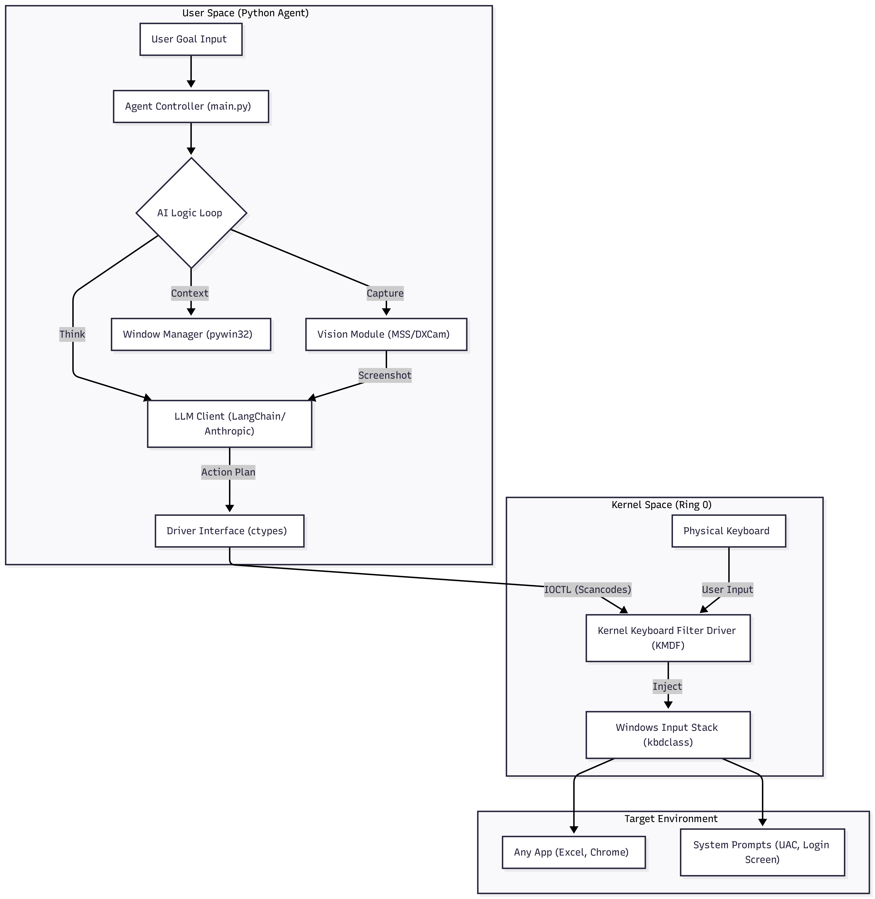

  A. Kernel-Level Keyboard Filter Driver (The "Hands")
   * Role: The critical component that grants "God Mode" typing capabilities. It sits in the kernel input stack,
     intercepting and injecting keystrokes at a level lower than any application or anti-cheat software.
   * Responsibilities:
       * Injection: Accepts raw scancodes from the Python agent via IOCTL and injects them directly into the input data
         stream. This bypasses UIPI (User Interface Privilege Isolation), enabling typing in UAC prompts, Admin
         terminals, and the Login screen.
       * Safety Override: Monitors the physical keyboard for a "Kill Switch" combo (e.g., Ctrl + Alt + Pause) to
         instantly disable injection if the agent malfunctions.
   * Tech Stack: C/C++, Windows Driver Framework (KMDF).

  B. Python Agent Controller (The "Brain" & "Eyes")
   * Role: A single, high-privilege Python process that manages the entire agent loop.
   * Responsibilities:
       * Vision (The Eyes): Uses mss (or dxcam for higher FPS) to capture the screen state.
       * Context (The Sense): Uses pywin32 to identify the active window title and process ID (e.g., "Notepad -
         Untitled").
       * Orchestration (The Brain):
           1. Captures state (Image + Window Title).
           2. Sends prompt to VLM (Claude 4.5 Haiku).
           3. Receives JSON response: {"action": "type", "text": "Hello World"}.
           4. Converts text to scancodes.
           5. Calls the Driver.
       * Driver Bridge: Uses Python's ctypes library to directly call CreateFileW (to open the driver) and
         DeviceIoControl (to send commands), eliminating the need for C++ middleware.

  ---

  3. Data Flow & Communication

   1. Start: User runs python main.py as Administrator.
   2. Loop:
       * Capture: mss.grab() takes a screenshot.
       * Context: GetForegroundWindow() retrieves the active app name.
       * Inference: The LLM analyzes the screenshot and current goal. It decides to "Click File Menu" (mapped to Alt+F).
       * Translation: Python converts Alt+F -> Scancodes 0x38 (Alt down), 0x21 (F down), 0x21 (F up), 0x38 (Alt up).
       * Injection: Python packs these into a struct and sends them to the driver via kernel32.DeviceIoControl.
       * Execution: The driver injects them. The OS sees "Hardware" input.

  ---

  4. Technology Stack (Hackathon Optimized)

   * Driver (C++):
       * WDK (Windows Driver Kit): Required for building .sys files.
       * KMDF: For stable, modern driver development.

   * Agent (Python):
       * `mss`: Ultra-fast, cross-platform screen capture.
       * `pywin32`: Access to Windows API (Window handles, process info).
       * `ctypes`: Native interface to call Kernel32.dll and talk to the driver.
       * `langchain` / `anthropic`: For AI logic and VLM interaction.
       * `pynput` (Optional): For user input monitoring (if not doing it in kernel) to pause the agent when the user
         moves the mouse.

  ---

  5. Security & Deployment (Hackathon Context)

   * Driver Signing (The Hurdle):
       * Solution: We will use Test Signing Mode. You will run bcdedit /set testsigning on and reboot your machine. This
         allows loading unsigned drivers for development/demo purposes.
       * Note: This places a "Test Mode" watermark on your desktop, which is fine for a hackathon demo.

   * Architecture Benefit: By keeping the logic in Python, you can iterate on the AI behavior instantly without
     recompiling the driver. The driver only needs to be "dumb" (receive code -> press key), minimizing Blue Screen of
     Death (BSOD) risks.

  ---

  6. Implementation Roadmap

   1. Phase 1: The "Dumb" Driver (C++)
       * Set up WDK & Visual Studio.
       * Build a minimal KMDF driver that exposes a device object (\Device\MyKeyboard).
       * Implement an IOCTL handler to print "Hello from Kernel" to the debug log.

   2. Phase 2: The Python Bridge
       * Write a Python script using ctypes to open the driver handle.
       * Send the IOCTL and confirm the driver received it (using DebugView).

   3. Phase 3: The "Hands" (Injection)
       * Update the driver to actually inject scancodes into the input stream using WdfRequestRetrieveInputMemory.
       * Test typing "A" into Notepad from Python.

   4. Phase 4: The "Brain" (AI)
       * Integrate mss and anthropic.
       * Create the loop: Capture -> Analyze -> Send Scancode -> Repeat.

FOR AI KEYBOARD WE NEED TO BUILD A TOOL, WHICH Captures snapshots/screenshots and sends it to VLM like haiku 4.5 and then returns the order of key stroke which r pressed in the keyboard.
Even making it run from terminal (i mean specifying the task to be performed in the terminal also is fine we dont need fancy UI but functionality is the main thing)